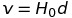
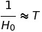
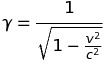
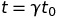
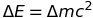
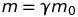
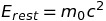

# Astrophysics and Relativity
Things are big: 4*10^16 m to our nearest star. 10^10 galaxies in the observable universe, 10^11 stars in a typical galaxy.

### Units
Parsec (pc) is the distance from the Earth to an astronomical object which has a parallax angle of 1 arc second. 3.086*10^16 m.

Astronomical Unit (Au) is the distance between the centre of the Earth and the centre of the Sun. 1.496 * 10^11 m.

## Measuring Distances
### Distance using the reflection of a radar pulse
This only works for objects in the solar system.

+ Radar pulse is transmitted and clock started
+ Pulse travels to planet and is reflected
+ Clock is stopped when the pulse is received back on Earth
+ The time taken for the journey out and back is recorded

Distance calculated by s = vt.

*Remember that the distance traveled is twice the distance to the object*

The reflected pulse is very weak compared to the noise (inverse square law) and so this will not work for objects outside the solar system. There is also a large margin of error because the signal may have reflected off anywhere on the planet. Planets are spherical and so some parts are further away. 

### Relative speed using radar pulses
Same as measuring distance but use at-least two measurements over a time and then use the change in displacement in time to approximate the speed relative to us of the object

### Stellar parallax
The amount things appear to move when looking at them from different angles. Hard to explain in words. See notes for a drawing.

### Cepheid Variables
Stars with a known brightness which can be spotted independently of distance. Their distance can then be worked out by their observed brightness and the inverse square law.

## The Expanding Universe
Hubble noticed that the wavelengths of galaxies outside out celestial group are all red-shifted. 

This can be spotted because gases in the stars have absorption lines (see particle physics topic) which are recognizable for the gases then red-shifted. 

Redshift shows that they are traveling away from us (think about the sound of a car as it goes past you vvrrroooommmmm).

Hubble found that the further away a planet was from us, the more red-shifted its radiation was (therefore the faster it is moving away from us). 

The expansion of the universe is not an explosion because there is no point of expansion: every point is moving away from every other point at a rate proportional to the distance. 

### Hubble's Law
 where v is the speed of recession from the observer, H0 is the Hubble constant and d is the distance to the object.

*There is no centre of expansion of the universe: if we were in 2D space we would be like points on a balloon's surface as it is inflated: every point becomes further apart from another by an amount proportional to their original separation.*

 The age of the universe is proximately the reciprocal of H0. (think about v=st)

### The Big Bang
If everything is moving apart then at some point in the past it should have been closer together. Physicists believe that everything used to be much closer together: all in a single infinitely dense point (the big bang singularity). 

The expansion of the universe is one source of evidence. Another is the abundance of light elements in the universe (see nuclear topic). Another is the cosmic microwave background radiation: this is the 'afterglow' of the big bang and is  an almost entirely uniform temperature (suggesting that the universe used to be much smaller).

### Fate of the universe
Three main theories:

+ Everything continues to expand forever: gravity is not strong enough to keep everything together
+ The expansion of the universe slows to a stop: gravity balances with whatever is causing the expansion
+ Gravity becomes stronger than whatever is causing the expansion of the universe and so everything moves back together again in a "big crunch"

### Big Bang Theory can't
+ Explain why there was enough change in density of the universe that galaxies and stars could form (why isn't everything entirely uniform?)
+ Explain the very early universe where quantum physics was important
+ Say anything about before the big bang.

### Big Bang theory does account for
+ The expansion of the universe 
+ The uniformity of the temperature of the cosmic background radiation
+ The ratio of hydrogen to helium

### Unification
Physicists believe that at the point of all of the forces of nature were unified as a singe force. First gravity diverged, then the strong force and finally electromagnetism and the weak force.

## Special Relativity
### Inertial Frames
An inertial frame of reference is one in which Newton's First Law is obeyed (the frame is not accelerating). If any frame of reference is moving at a *constant* velocity relative to an inertial frame then it is also an inertial frame. The earth is approximately an inertial frame.

### Starting points of the special theory of relativity
1. Physical laws have the same form in all inertial frames
2. The speed of light in free space is the same in all inertial frames

### The gamma factor

This determines the amount by which masses increase, time slows down and energy increases as an object approaches the speed of light.

### Time Dilation
t0 is the time an event takes for an observer with no relative velocity. However any observer at relative velocity v the actual time taken will be:

### Mass and Energy
Mass and energy are equivalent: 

Mass changes with approach to the speed of light in the same way as time does:

	the rest mass as measured by as stationary will be lower than the mass measured by an observer with relative velocity v.

### Rest energy
The rest energy of an object is the energy that would be released if all of that object's mass was converted into energy:

## Space-Time
### Representing Space-time
The observable universe has 4 dimensions: 3 spacial and one time.

If the universe is simplified to 2 spacial dimensions: one can think of each particle as a vector on a graph where one axis is time and the other two are displacement. As velocity and displacement are proportional, one can also draw a similar graph where the spacial dimensions  are replaced with velocity in that direction. In such a graph the length of a vector is always the speed of light: therefore while there is no velocity the time continues as normal. However as the vector points more towards the velocity axes and less towards the experienced time will decrease relative to time kept by an observer. At the speed of light time is not experienced (which happens on these graphs).

### Light Cones
On space-time diagrams (as described previously) a light cone can be drawn from a point. The inside of this cone is where it is possible for the object to effect at that time: outside the cone the object would have to move faster than the speed of light to be. The cone is drawn from the object's world line: its path through space time.

