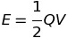

# Capacitors & Expodentialls
## 1 - Logs
+ ln(ab) = ln(a) + ln(b)
+ ln(a/b) = ln(a) - ln(b)
+ ln(x^n) = nln(x)
+ ln(e^{kx}) = kx

## 2 - Exponentials
 the rate of change of x in t depends upon the instantaneous value of x.

Some examples of exponential relationships:
+ Radioactive Decay
+ Capacitor charging and discharge
+ The rate of liquid level change in a leaking tank
+ Air leaking from a bike tube
+ Rate of cooling
+ Population growth
+ Damping

There are other notes for this topic but they have been very adequately covered in maths too.

## 3 - Capacitance
Batteries store energy based on chemical reactions whereas capacitors store energy in electric fields.

Capacitors are used widely in electronics for timing, temporary stores of energy (like a camera flash) or for protecting equipment from voltage surges.

A capacitor is a pair of parallel conductors with an insulating material (a direttic) between the plates.

The unit for capacitance is Farads (F). This is a very large unit and so one normally uses between microfarads and picofarads.

Q = CV  where C is capacitance, Q is charge and V is potential difference.

### Charging
Charge builds up on plates when a battery is connected across them.

When the maximum charge (number of electrons) permitted by the capacitance has built on the capacitor it is said to be charged.

At this point the potential difference across the capacitor is the same as that of the supply.

### Discharge
Initially charge flows towards the positive plate at a fast rate due to the high negative charge of the lower potential plate repelling the electrons towards the positive plate. This current decreases as time continues because the movement of the charge lowers the potential difference. Therefore the current flowing is proportional to the instantaneous charge remaining on the plates: an exponential relationship.

Symbol | Description
-------|------------
Q | Charge at time t
Q_0 |  Charge at time t = 0
t | Time
RC | Time constant (tau)

As potential difference is proportional to charge, one can also say:

And as current is proportional to potential difference:

### Energy Stored in a Capacitor
We know the following from AS:

By substituting Q = CV:

