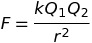
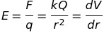
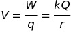
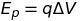
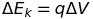

# Electric Fields
## Comparison With Gravitational Fields
In general, where a gravitational field is defined in terms of mass, an electric field will be defined in terms of charge. This is because these are the properties that are the sources of the field.

Another difference is the constants in the equations.

Also very importantly, gravitational fields always supply an attractive force. Whereas, electric fields can be either attractive or repulsive and so it is very important to keep track of signs when making calculations.

## Coulomb's Law - the force between charges
 where k is a constant, Q1 and Q2 are the charges involved and r is the distance between the charges.

The force acts along the field line joining the charges.

## Field Lines
Field lines always show the direction which a small *posotive* test charge would accelerate when placed in the field.

The field is stronger where the arrows are closer.

## Electric Field Strength: E
This is the force per unit charge:

 where V is potential difference (see later).

## Electric Potential: V
Potential is the work done moving a unit charge from infinity to that point.

   where W is the work done moving the charge from infinity to that point.

Work as to be done to pull charges apart (if opposite sign) or to bring them closer (same sign).

## Electrical Potential Energy: Ep

A.k.a. The change in Ep is equal to the work done.

## Uniform Electric Fields
Uniform fields form between parallel charged plates provided that their separation, d, is very small compared to their surface area.

Note that at the edges of the plates there is not a uniform field.

**These fields are called uniform because the potential is *constant* between the plates.**

This means that equipotential lines are evenly spaced between the plates.

### Particles in uniform fields
  This is very useful and important to remember.
