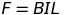
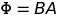
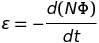
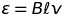
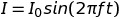
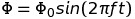
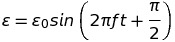

# Electromagnetism
## Magnetic Fields
A magnetic field is a region of space in which magnets (and moving charges) will experience a force. By convention, the direction of a magnetic field goes from **North to South**.

Like poles repel, unlike poles attract. Unmagnetized materials can be attracted to either pole.

Some magnetic materials loose their magnetism more easily than others. These are called "soft" materials and they make temporary (soft) magnets.

Permanent ("hard") magnets do not lose their magnetism.

### Current
When a current flows down a wire there are moving charges and so it creates a magnetic field. The field lines form circles around the wire.

## Solenoids and Coils
A solenoid is made of a coil of wire that shares a straight axis. Its field lines look similar to those of a bar magnet.

An iron core can be used to make the field more concentrated as most of th field lines will go close together to fit in the higher permanence iron (and closer field lines means a stronger field.)

### Increasing Field Strength
+ **Increase** current and the number of coils.
+ **Decrease** the length of the air gap and the length of the magnetic circuit.
+ Use a core with a higher permanence - this can be done by using iron, using a high cross sectional area and a short length (*think like electrical conductance*). 

## The Motor Effect
If a wire carrying a current is at an angle to a magnetic field, it will experience a force perpendicular do the direction of the magnetic field. 

One can use their left hand to relate the direction of these quantities: if one holds their left thumb, first and second fingers perpendicular to each-other the direction of the thumb will be the force, first finger will be the magnetic field (N to S) and second finger will be *conventional* current. 

The magnitude of the force from the motor effect can be calculated using the following:

 where B is the magnetic field strength, I is the current and L is the length of wire which is in the magnetic field.

Magnetic field strength (B) is measured in Tesla (T). Remember that field strength is how close field lines are? Well similarly B is the unit of flux density.

## Electromagnetic Induction
### Flux
 where Phi is total flux, A is the cross sectional area and B is flux density (field strength).

The unit of flux is Wb.

### Faraday's Law
Faraday's law states that the induced e.m.f. (potential difference) is proportional to the rate of change of flux linkage:

This means that whenever the amount of flux changes or flux lines are cut, a voltage will be measured.

The direction of these quantities can be worked out using the right hand rule. This is similar to the left hand rule however, the thumb now represents motion.

### Flux Cutting In A Uniform Magnetic Field
It can be derived (see notes) that when a wire length l is moved with speed v perpendicularly through a uniform flux density B that the following emf will be induced:

### Faraday's Law and Transformers
Transformers only work with AC. This is because emf is only induced while the flux (proportional to current) is changing (as stated by Faraday's law). This is why alternating current is used. Assuming that the AC supply varies sinusoidally and that at t = 0, I = 0: the following relationships are true:

		note the change in phase here. This is because the induced emf is proportional to the *differential* with respect to time of flux linkage.

### Lenz's Law
**A.K.A the reason for the negative sign in Faraday's Law**

When the emf is induced, if it is in a closed circuit it will cause current to flow which in turn will cause a magnetic field. If this magnetic field were in the same direction as the one that caused it then it would strengthen it's self: creating energy. This is how we know that the induced emf will be in the opposite direction. This change in direction is shown by the negative sign and is refereed to as Lenz's Law. 

This induced emf is called "back emf" and it results in eddy currents.

## Motors and Generators
 