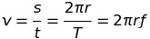
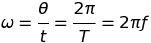
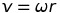
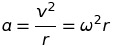
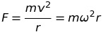

# Further Mechanics and Gravitation
## 1 - Further Mechanics
### Momentum
 momentum is equal to mass times velocity.

Momentum is a vector and its direction is the same as the velocity of the object.

### Newton's Laws of Motion
#### First Law
An object will remain at a constant velocity (or at rest) while there is no overall force applied to it.

#### Second Law

#### Third Law
For every action there is an equal and opposite reaction force. For example, if you punch a wall it hurts your hand.

### Impulse
Impulse is the change in momentum:

 Therefore impulse can be found by integrating force with respect to time.

So for a set change in momentum (e.g. a car coming to a halt in a crash) the area under the force/time graph will be the same. Therefore to minimize the magnitude of the force experienced, the total time in which the momentum is changed should be reduced (this is the thinking behind crumple zones).

### Conservation of Momentum
The total momentum in an *isolated* system is always constant.

### Collisions
Elastic - Ek is conserved.

Inelastic - Ek is not conserved.

Perfectly Inelastic - Ek is not conserved and the two particles stick together after the collision.

*Momentum is conserved in all collisions!*

### Circular Motion
**Centrepetal force** is the force which acts towards the centre of a circular motion in order to keep the object accelerating towards the centre. This acceleration is required because while the speed of the object may remain the same as it travels in a circle, velocity is a vector and so any change in direction is acceleration and is caused by a force (F=ma).

Therefore, the velocity is always at a tangent to the circular motion of the object and the centripetal force at right angles to it (it points towards the centre of the circle).

 where v is the *speed* of the object, s is distance, t is time taken, T is time period, f is frequency and r is the radius of the circle.

 where omega is the angular velocity and theta is the angle sweeped in radians.

Therefore:

....

Therefore:

## 2 - Gravitation
Same concepts as electric fields.

Remember that gravity is a vector field (it has direction) and its direction is always attractive. Often when considering orbits it is useful to make gravitiational force equal centripetal force so that relationships can be derived.

Some examples of scalar (non-directional) fields are temperature and pressure.
