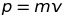
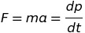
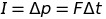
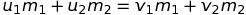

# Further Mechanics and Gravitation
## 1 - Momentum
 momentum is equal to mass times velocity.

Momentum is a vector and its direction is the same as the velocity of the object.

### Newton's Laws of Motion
#### First Law
An object will remain at a constant velocity (or at rest) while there is no overall force applied to it.

#### Second Law

#### Third Law
For every action there is an equal and opposite reaction force. For example, if you punch a wall it hurts your hand.

### Impulse
Impulse is the change in momentum:

 Therefore impulse can be found by integrating force with respect to time.

So for a set change in momentum (e.g. a car coming to a halt in a crash) the area under the force/time graph will be the same. Therefore to minimize the magnitude of the force experienced, the total time in which the momentum is changed should be reduced (this is the thinking behind crumple zones).

### Conservation of Momentum
The total momentum in an *isolated* system is always constant.

### Collisions
Elastic - Ek is conserved.

Inelastic - Ek is not conserved.

Perfectly Inelastic - Ek is not conserved and the two particles stick together after the collision.

*Momentum is conserved in all collisions!*
