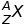
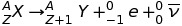
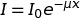
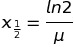
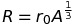

# Nuclear Physics
## Nuclear Structure
Atoms are made up of a very small and dense nucleus and then a large space where its electrons traverse. The nucleus makes up almost all of the atom's mass and is completely unchanged by chemical reactions. 

The nucleus is made up of negatively charged protons and uncharged neutrons. It is held together despite the electrostatic repulsion of the protons by the strong interaction.

Atoms contain equal numbers of electrons and protons. Ions have a different number of electrons and protons.

**Notation:**
	X is the element symbol (e.g. C for carbon), A is the atomic mass number (the number of nucleons) and Z is the proton number.

A *nuclide* is any particular type of nucleus.

All nuclei with the same Z (proton number) are the same *element*.

Nuclides with the same proton number but a different mass number are *isotopes* of the same element.

*Radioactivity* refers to the emission of particles from the nucleus as a result of nuclear instability.

When a parent nucleus decays into a daughter product, its disintegration is spontaneous.

### Beta Decay
Where X is the parent nuclei, Y is the daughter, e is an electron and the other product is an anti-neutrino:

## Risk & Health
Radiation ionizes matter: it knocks electrons off atoms.

Radiation looses energy as it ionizes things as removing each electron takes energy. 

### Calculating Risk
Risk = Probability*Consequences

Absorbed dose = (Energy Absorbed)/Mass

Absorbed dose is measured in grays (Gy). The equation is self explanatory.

Dose Equivalent = (Absorbed Dose)(Quality Factor)

Dose equivalent is a measure of the damaged caused. It is measured in Sieverts (Sv). 

Alpha radiation has a quality factor of 20, neutrons have a quality factor of 10 and beta, gamma and X-rays all have a quality factor of 1.

An absorbed dose equivalent of 1 Sv will lead to approximately a 5% risk of cancer. 

## Radiation Protection
In air, gamma radiation intensity follows the inverse square law due to it spreading out. 

Alpha and beta are easy to protect against by just standing back or by using at most a thin sheet of lead.

### Gamma ray Absorption
Gamma radiation is absorbed by materials due to the material becoming ionized, the radiation being scattered by electrons and through electron-positron pair production.

The intensity of gamma radiation decreases exponentially depending upon the properties of the material as described below:

 where I is the intensity, x is the distance traveled through the absorber and mu is the absorption co-efficient of the material. 

There is a half distance for materials. This can be calculated by the following:

## Atoms
### Size Inside Atoms
The nucleus is about 10 000 times smaller than the atom.

The nucleus is made of protons and neutrons in motion inside it.

These are made of three quarks each. There is no evidence that quarks have any size at all.

### Calculating size
If the nucleus is modeled as a sphere and it is assumed that nucleons are packed into the tightest possible arrangement then one can use the following approximation: 

	for nuclear radius R, atomic number A and constant r0. 

## Stability and Atomic Forces
### Strong Nuclear Force
Key properties of the strong nuclear force:

+ It is very strong (about 100 times stronger than the electrostatic force)
+ Acts on nucleons
+ Very short distances (about 3*10^-15)

#### The Need For Neutrons
Two protons alone cannot bond because the nuclear force cannot overcome the electrostatic repulsion. The neutrons contribute to the strong interaction but are not charged and so do not contribute to EM repulsion. 

Therefore as nuclei get larger, they need more neutrons to hold them together.

## Mass and Energy
Mass is a form of energy. Therefore one can say that a hot cup of tea is heavier than a cold one and a person running is heavier than a person stood still.

When a nuclear decay or fusion occurs, there will be a change in mass. This change in mass can be used to work out the change in binding energy.

### Binding Energy
The total Ep of all of the separate nucleons > total Ep of nucleons in nucleus
Therefore the total mass of all of the separate nucleons > total mass of the nucleus

The binding energy of a nucleus is the total energy required to separate its component nucleons.

This is negative because work is needed to separate the nucleons.

The more negative the binding energy is, the more stable the nucleus is.

## Fission and Fusion
###  Fission
When a high energy neutron collides with a nucleus: making it unstable, leading it to split into at-least two other elements and some radiation.

For example, when a neutron collides with a uranium 235 nucleus, the nucleus becomes unstable and splits into two daughter nuclei along with two or three neutrons (each with high kinetic energy)

Large nuclei have many neutrons and so two or three neutrons are released after a collision with a single neutrons: this results in a chain reaction.

A moderator must be used to control the chain reaction. Graphite is often used. This absorbs some of the neutrons, slowing the rate of reaction.

The fission produces a lot of heat and so coolant must be used to carry the heat away from the fuel to the boiler where turbines are turned by the steam.

### Fusion
When small nuclei are fused, energy is released. This is because the binding energy of the product is grater than that of the reactants.

This requires the nuclei to have a very large kinetic energy so that they can overcome the coulomb repulsion. This takes huge temperatures and pressures.

Energy from fusion can be calculated by looking at the change in mass between the reactants and the products.