# Oscillations
## 1 - Describing Motion
### Graphs
 - Velocity is the first derivative of displacement.
 - Acceleration is the second derivative of displacement and the first derivative of velocity.
 - Derivatives go in order: sin(x) -> cos(x) -> -sin(x) -> -cos(x) -> sin(x)

**Remember to use radians!**

### Definitions
 Quantity   | Symbol | What is it?                       | Unit
------------|--------|-------------                      |-----
Time Period | T      | Time for an oscillation           | Seconds (s)
Frequency   | f      | Number of oscillations per second | Hertz (Hz)
Equilibrium Position | | Where the system is at rest with no energy |
Amplitude   | A | Maximum displacement from equilibrium | Meters (m)
Displacement | x or s | Vector distance from equilibrium | Meters (m)
Restoring Force | F | Resultant force which provides the acceleration towards equilibrium | Newtons (N)

### Simple Harmonic Motion
*Acceleration is proportional to displacement from the equilibrium position*

<!-- LaTeX to images at http://www.sciweavers.org/free-online-latex-equation-editor -->
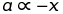

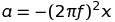

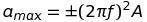   - this occurs at x = 0

Omega is the angular velocity (see further mechanics):

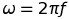

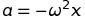

Omega is also the co-efficient of t when writing x in terms of t. This is because it makes the graph have f cycles for every second (t).

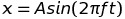  - for x = 0 at t = 0

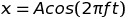  - for x = A at t = 0

Or the more elegant way of accounting for the phase:

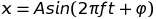 - for any phase

### Oscillations Of A Mass Hanging On A Spring
Hooke's Law:
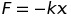

Proof that this is SHM and derivation:

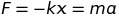    - Using Newton's Second Law

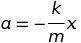    - a is proportional to minus x so this is an example of simple harmonic motion

Period of a mass on a spring:

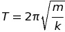    - Note that **T is independent of A**

## 2 - Energy in SHM
### Energy When Stretching A Spring

Energy = work done stretching the spring

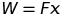    This is the *average* force

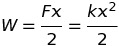   The negative is ignored as energy is scalar

### Energy in SHM

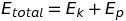    (if no dampening)

As kinetic energy is proportional to velocity squared, kinetic energy will be at a maximum at the equilibrium and at a minimum at the largest displacements.

Potential energy is always the inverse of the kinetic energy so that the overall energy in the system can remain constant. Therefore, potential energy is at a minimum in equilibrium position and at a maximum when displacement is largest.

## 3 - Damping and Resonance
### Damping
Damping can be observed as an exponential decrease in amplitude as the system oscillates. This is due to the system doing work against resistive forces (i.e. Etotal does not remain constant).

The maximum velocity also decreases because the kinetic energy decreases (as a result of total energy decreasing). T and f are unchanged.

Critical dampening is the highest rate of energy loss so the system takes the least time to stop oscillating.

### Resonance
Free oscillations - The *natural frequency* of a system is the frequency of un-driven oscillations.

Forced oscillations - When an oscillating system is acted on by a periodic force (e.g. a child being pushed on a swing)

Resonance occurs when a system is driven at it's natural frequency by a driving force. This causes constructive interference resulting in a much greater amplitude.
