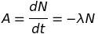
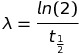
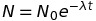
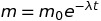
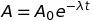
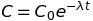

# Radiation
## 1 - Ionizing Radiation: Types and Properties
**Alpha Particles** are comprised of two protons and two neutrons. This is the same as an He nucleus. Alpha particles cannot penetrate paper.

**Beta Particles** are fast moving electrons (around 0.98c). Beta particles can penetrate paper but can be stopped by a thin aluminum sheet.

**Gamma Radiation** consists of high energy photons. As gamma radiation has wavelike properties its intensity decreases according to the inverse square law at a rate dependent upon the material it is traveling through. For example, Gamma Radiation can remain ionizing for a long distance through air but for a much reduced distance through lead.

**Radioactivity** is the particles which are produced during the spontaneous decay of a nuclei into a daughter (or decay product). This happens to allow the original nuclei (which will have been unstable) to become a more stable nuclei (the decay product).

**Decay** of a nuclei is an exponential relationship because they decay occurs at a random time for each nuclei and so the rate of decay (activity) is proportional to the instantaneous number of remaining nuclei in a sample. Therefore the values we calculate are averaes.

## 2 - Radiation Experiments
### Activity
The activity of a sample is its average rate of decay: the average number of nuclei in the sample which decay in each second.

 where N is the number of nuclei and lambda is the decay constant (see later).

As activity is the change in a number with time, it's unit is the Becquerel (Bq) which is equivalent to s^{-1} (which is equivalent to Hz).

Activity is different to the **count rate** because the count rate (the number of radioactive particles measured by a detector per second) is not an average and is also less because not every particle is detected.

**corrected count rate = count rate - background count rate**

### Decay Constant
     where t(1/2) is the half life of the radioactive sample.

The Decay Constant is a measure of how quickly a radioactive sample decays and as one can see from the equation, its unit is s^{-1}

This is the same as the fraction of nuclei in a sample which are expected to decay within a unit time.

This is also the same as the probability that an individual nuclei will decay.

### Activity Equations
By solving the activity equation (it is a differential equation) one can find the following equation for *constant time and decay unit*.

 for N nuclei remaining starting from N_0 nuclei at the time when t = 0.

And as the related quantities are proportional to the number of nuclei remaining, the following relationships are also true:

 where m is the mass of the sample.

 where C is the measured count rate.
