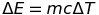
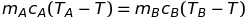
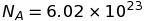
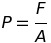

# Thermal Physics

## 1 - Changing Temperature

### Units
We don't use degrees Celsius in physics because it is not an absolute scale: 0 degrees Celsius is not 0 temperature. 0 Degrees Celsius is set completely arbitrarily at the temperature at which water changes state between solid and liquid.

Instead physicists use degrees Kelvin. Degrees Kelvin are the same size as degrees Celsius however they start at absolute zero: the real point at which an object has no thermal energy. As a consequence of this, it is impossible to have negative temperatures in Kelvin.

To convert from Celsius to Kelvin, one adds 273 (as absolute zero is approximately -273 degrees Celsius).

*20\`C Is not twice as hot as 10\`C, however 20\`K is twice as hot as 10\`K because Kelvin is an absolute scale.*

### Energy
  where E is energy, m is the mass of the object, c is the specific heat capacity of the object (constant) and T is the temperature in degrees Kelvin.

#### Mixtures
Assuming that the only energy transfers are between the two substances:

 where T is the final temperature.

Here the warmer object will cool down and the cooler object will warm up. This works as a weighted average between the two objects.

### Gasses
#### Quantities And Moles

A mole is a unit of the amount of substance in a sample in terms of the number of particles in it. It is defined as containing the same number of particles as there are in 12g of Carbon-12.

This number is called Avogadro's constant: 

Conversion:
The number of particles, N is equal to the number of moles multiplied by Avogadro's constant.

Quantity            | Description
--------------------|-------------------------------
Avogadro's Constant | Number of particles in a mole
M                   | Molar Mass
m                   | Mass of a particle
N                   | Number of particles
n                   | Number of moles

#### Pressure

