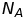

# Thermal Physics

## 1 - Changing Temperature

### Units
We don't use degrees Celsius in physics because it is not an absolute scale: 0 degrees Celsius is not 0 temperature. 0 Degrees Celsius is set completely arbitrarily at the temperature at which water changes state between solid and liquid.

Instead physicists use degrees Kelvin. Degrees Kelvin are the same size as degrees Celsius however they start at absolute zero: the real point at which an object has no thermal energy. As a consequence of this, it is impossible to have negative temperatures in Kelvin.

To convert from Celsius to Kelvin, one adds 273 (as absolute zero is approximately -273 degrees Celsius).

*20\`C Is not twice as hot as 10\`C, however 20\`K is twice as hot as 10\`K because Kelvin is an absolute scale.*

### Energy
  where E is energy, m is the mass of the object, c is the specific heat capacity of the object (constant) and T is the temperature in degrees Kelvin.

#### Mixtures
Assuming that the only energy transfers are between the two substances:

 where T is the final temperature.

Here the warmer object will cool down and the cooler object will warm up. This works as a weighted average between the two objects.

## 2 - Gasses
### Molecular Motion in Gasses
Brownian motion - viable particles (such as ash) in air move in a 'jittery' way. This is because they are being bombarded by air molecules.

Random walk - as a result of this bombardment, particles are observed to move randomly. Therefore the *average* displacement after a large number of steps is zero. However, there is still a displacement at a time which can be described as follows:

   where x is the displacement after N steps.

### Quantities And Moles

A mole is a unit of the amount of substance in a sample in terms of the number of particles in it. It is defined as containing the same number of particles as there are in 12g of Carbon-12.

This number is called Avogadro's constant: 

Conversion:
The number of particles, N is equal to the number of moles multiplied by Avogadro's constant.

Quantity            | Description
--------------------|-------------------------------
Avogadro's Constant | Number of particles in a mole
M                   | Molar Mass
m                   | Mass of a particle
N                   | Number of particles
n                   | Number of moles

### Pressure
 where P is pressure, F is force and A is area.

### Molecular Theory of Gases
Gases are made up of a large number of very small molecules. These molecules collide with one-another and the container they are in. When they collide with the container their momentum will change and so they will cause a force on the container (Newton's second law). Hence gases have pressure.

Gases have a temperature which is related to the average kinetic energy of the particles in the gas. Therefore as temperature increases so will pressure because the particles will collide with the container with more energy.

### Ideal Gases
An ideal gas is a set of assumptions used to model the actions of a gas mathematically. In reality ideal gases do not exist but the model works well in situations far from liquidation and not in extreme situations.

Particles in ideal gases collide elastically and experience no intermolecular forces. This means that they cannot liquefy.

#### Gas Laws
The following gas laws can be shown by experimentation:

*Boyle's Law* - Pressure is inversely proportional to volume

*Pressure Law* - Pressure is proportional to temperature

*Charle's Law* - Volume is proportional to temperature

*Ammount Law* - Pressure is proportional to the number of particles

All of these gas laws can be combined to the following equation:

  where P is pressure, V is volume, k is the Boltzmann constant, N is the number of particles of gas, T is absolute temperature, n is the number of moles of gas,  is the Avogadro constant and R is the molar gas constant.

Note:  as one can see from the equations above.

As R is constant, the following equation can be constructed for a gas under conditions 1 and then conditions 2:

## 3 - Temperature and Energy
### Kinetic Theory of Gases
To simplify this we need a number more assumptions about gases:
1. The number of molecules in the sample is very large
2. The molecules move randomly in all directions
3. Collisions between molecules and the container are elastic
4. Volume of the molecules themselves is negligible
5. Attractive force between molecules is negligible

(ommitting derivation because I am lazy and have already written about this at great length for my computing project)

 where m is the mass of a particle and  is the root mean square speed of molecules in the gas. The root mean square speed is useful because this is approximately the speed that a gas will propagate into a vacuum.  

This can also be expressed in terms of gas density:

 where p is the density of the gas:

Further derivation can show that:

Also useful:

This shows that for two gases at the same temperature; the root means square speed is larger for the gas with smaller molecular mass.

### Diffusion Of One Gas Into Another
Due to collisions between particles of the gases, this will be much slower than expansion into a vacuum. However this is still proportional to the root mean square speed which is inversely proportional to the square root of the mass of the gas molecules.

Therefore gases with molecules of lower mass (e.g. hydrogen) will diffuse faster than those of higher mass (e.g. carbon dioxide).

### Internal (Total) Energy Of A Sample Of Gas
This can be worked out by using the total kinetic energy of all of the particles:

### Thermal Equilibrium
*Macroscopic* - thermal equilibrium when there is no net energy flow between two objects.
*Microscopic* - thermal equilibrium when the average kinetic energy is the same for molecules from each gas.

## 4 - The Boltzmann Factor
See topic notes for probability distribution graphs for energy and molecular speed.

Particles in a set do not all have the same energy. Some of them 'get lucky' by being hit by several other high energy particles in the same direction. This leads to the particle gaining a higher than usual energy.

The Boltzmann factor is the ratio of particles with the higher energy over the number of particles with average energy. This is the same as the probability of a particle having the higher energy.

This describes many situations in physics. For example this shows why water will evaporate at less than 100'C: some of the particles 'get lucky' and gain a far higher than average energy and so can evaporate.

 where fB is the Boltzmann factor and epsilon is the amount of energy more you are calculating for (usually the activation energy).

The Boltzmann factor can explain many things:
1. Viscosity of Liquids - activation energy for particles to move staging intermolecular forces
2. Ionization of a Semiconductor - atoms need enough energy to become ionized, freeing electrons which can conduct electricity
3. Evaporation of liquids - explained earlier
4. Ionization in a flame - molecules need enough energy to dislocate into ions
5. Many chemical reactions - particles must collide with an activation energy to create the new chemical bonds
6. Nuclear fusion in the sun - protons must have enough energy to get close enough to fuse into deuterium
