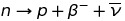
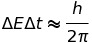
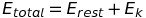
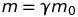
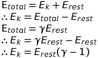

# Particle Physics
Particle physics is the study of particles the size of a nucleon and smaller.

**Fermion** - A particle which can never be in the same quantum state as another fermion.

**Lepton** - A fundamental particle which does not experience the strong interaction (such as electrons, positrons, neutrinos and anti-neutrinos). Leptons are fermions.

**Gauge Bosons** - fundamental particles which mediate interactions (cause the forces of nature). Photons and gluons are examples of guage bosons. Gauge Bosons are not fermions.

**Hadrons** - particles which experience all interactions. Hadrons are quarks and larger particles made out of quarks. 

**Mesons** - a type of hadron which is made of two quarks. These quarks have to have the same colour and must be antiparticles of each other (so that colour is conserved). Mesons are not fermions.

**Baryons** - baryons are hadrons made of three quarks. These must either be all antiparticles or all not (again because of conservation of quantum numbers). Baryons are fermions.

**Nucleon** - a proton or a neutron. These are both baryons and so are also fermions.

**Neutron** - is a nucleon => baryon => hadron. Neutrons are made of two down and one up quarks.

**Proton** - is a nucleon => baryon => hadron. Protons are made of two up and one down quarks.

### Particles and Antiparticles
Every type of particle has an antiparticle. Ordinary matter consists of no antiparticles.

The charge and quantum numbers of a particle and its antiparticle are opposite but they both have the same mass and lifetime.

### Beta decay
The conservation of energy and momentum allows only one possible energy for a beta particle to have after beta decay. However, a *range* of energies are observed. Therefore some momentum must be being given to another hard to detect particle: a neutrino. 

	neutrons are not stable outside the nucleus and will decay like this after some time.

## Particle Interactions
The significant forces in particle interactions are the strong and weak nuclear forces and electromagnetism. The strong force only applies to hadrons and it holds nuclei together. The weak force and electromagnetism work against the stability of nuclei.

Forces are passed from one particle to another by gauge bosons which exchange the force between them. 

### Electromagnetic Interactions
This is called quantum electrodynamics (see AS quantum topic).

### Weak interaction - B- decay

The process:
1. Neutron emits a W- and decays into a proton.
2. After ~10^-10s the W- decays into an electron and an anti-neutrino.

The total energy before and after the W- boson's existence is conserved however during the boson's existence *energy conservation is violated!*

According to Heisenberg's uncertainty principle, the energy of a system that spends a time delta t in any particular state is uncertain to an extent delta E where:

Thus a particle of energy E can be created without violating the law of conservation of energy as long as it lasts for less than delta t.

## Quarks
Quarks are held together by exchange of virtual particles called gluons to form hadrons. Gluons mediate the strong interaction.

There are six 'flavors' of quark: up, down, strange, charm, top and bottom.

The only types of quark in normal matter are up and down quarks.

Quarks cannot exist on their own. As two quarks are pulled further apart the strength of their iteration increases until there is enough energy to create a new hadron.

Up quarks have a charge of +2/3 e.

Down quarks have a charge of -1/3 e.

Quarks have a property called colour charge. Anti-quarks have anti-colour. The colour charge can be red, green or blue. For a particle to exist it must have no overall colour: e.g. red blue and green make white: no colour. e.g.2. blue and anti-blue result in no colour. e.g.3. blue and anti-green cannot exist together because this creates an overall colour.

### Conservation
Energy is conserved before and after an interaction (although during an interaction energy may not be conserved for a short time: see beta decay).

Electric charge is also conserved.

Momentum is also conserved. This is the main evidence for the existence of neutrinos.

Lepton number is conserved: if we create a particle an antiparticle must also be created.

Baryon number is also conserved: the mass numbers before and after an interaction must match (this is the number of baryons).

There are other quantum numbers such as strangeness and spin but they are not on the syllabus.

## Electrons in Atoms
Electrons can only exist in particular quantized energy levels (think of some stairs). If an electron has too much energy for an energy level but not enough energy to make it to the next energy level then it releases the extra energy as a photon. 

This explains the emission and absorption spectrum of gases: when the electrons change energy they move to different energy levels. The excess energy from moving between energy levels is released as photons. The photons can be any energy except the exact energy changes that would instead result in the electron moving to a different energy level. This leads to absorption or emission lines unique to each element where only very faint (if at all) photons are produced on transition between electron states. As it takes the same energy to move up to a higher energy state as it does to move back down to the lower one, absorption and emission lines occur at the same wavelengths.

### Fermions and the Pauli Exclusion principle
Leptons, baryons and quarks are fermions. Bosons and mesons are not.

Electrons being fermions is the reason why they do not all end up in the ground state: two electrons with the otherwise same quantum numbers must go at different energy levels to satisfy the Pauli Exclusion Principle.

This is why matter is hard: you cannot squeeze the particles into all the same state.

### Schroedinger Model - standing waves
Schroedinger theorized that electrons can only exist as standing waves around the nucleus. This explains why the energy levels are quantized. 

However this model is not perfect: it makes some incorrect predictions and it only works in two dimensions.

## Using Energy/Mass Equivalence
All of these calculations can be done using energy mass equivalence:

It is important to consider a particle's total energy:

### Annihilation
When a particle and its anti-particle meets its antiparticle they annihilate converting the mass of the particles entirely into energy. This energy is released as **two** gamma photons. *Two gamma photons are needed so that momentum is conserved*.

### Pair Production
This is the inverse of annihilation. This is when a gamma photon of sufficient energy turns into a particle / antiparticle pair. 

### Relativistic Calculations
As particles reach speeds close to c mass will vary as described in the astrophysics and relativity topic:

Follows is a derivation of relativistic kinetic energy:

